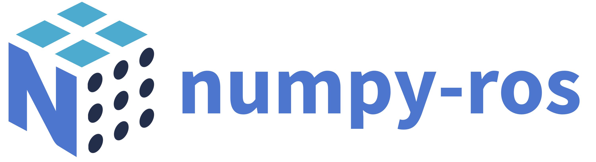

# numpy-ros

Seamlessly convert between ROS messages and NumPy arrays. Installable via your 
favorite Python dependency management system (pip, poetry, pipenv, ...) &ndash; 
no matter what ROS version you're on.

### Table of Contents
 - [Installation](#installation)
 - [Usage](#usage)
   - [Supported Types](#supported-types)
   - [Custom Handlers](#custom-handlers)
 - [License](#license)
 - [Acknowledgements](#acknowledgements)


# Installation

numpy-ros is distributed via PyPI for Python 3.6 and higher. To install, run:

```bash
# pip
$ pip install numpy-ros

# poetry
$ poetry add numpy-ros

# pipenv
$ pipenv install numpy-ros
```

ROS messages of type `Quaternion` are by default converted into numpy arrays of
type `np.quaternion`, which are provided by the 
[numpy-quaternion](https://github.com/moble/quaternion) package. To make use
of hardware acceleration and certain advanced features of numpy-quaternion,
consider installing with the optional scipy and numba dependencies. For more 
information, see the numpy-quaternion documentation.

```bash
$ pip install 'numpy-ros[quaternion-extras]'
```

Support for installation via conda is targeted for future releases.

# Usage

Converting a ROS message into a NumPy representation and back is as simple as
calling the `to_numpy` and `to_message` functions:


```python
from numpy_ros import to_numpy, to_message
from geometry_msgs.msg import Point


point = Point(3.141, 2.718, 42.1337)

# ROS to NumPy
as_array = to_numpy(point)


# NumPy to ROS
message = to_message(Point, as_array)
```

Note that `to_numpy` expects the ROS message to convert as its first 
positional argument, whereas `to_message` expects the ROS message _type_ (i.e.
the specific subclass of `genpy.Message`). Other than that, either function may
take any number of positional and keyword arguments. 

For some message types, keyword arguments can be used to finely control the
conversion process. For example, `Point` messages (among others) can be
converted directly into homogeneous coordinates:

```python
# Returns array([ 3.141 ,  2.718 , 42.1337])
as_array = to_numpy(point)

# Returns array([ 3.141 , 2.718 , 42.1337 , 1.0])
as_array_hom = to_numpy(point, homogeneous=True)
```

Also note that `to_numpy` may return multiple values, depending on the message
type. Similarly, `to_message` may require multiple positional arguments to
assemble the message object:

```python
from geometry_msgs.msg import Inertia

inertia = Inertia(...)

mass, center_of_mass, inertia_tensor = to_numpy(inertia)
message = to_message(Inertia, mass, center_of_mass, inertia_tensor)

inertia == message # true
```

## Supported Types

Currently, numpy-ros provides conversions of the message types listed below. More extensive documentation will be provided in the near future. 

## geometry_msgs

| Message Type                 | `to_numpy` | `from_numpy` | `kwargs`                         |
|------------------------------|:----------:|:------------:|----------------------------------|
| `Accel`                      | ✅         | ✅           | `homogeneous` (default: `False`) |
| `AccelStamped`               | ✅         |              | `homogeneous` (default: `False`) |
| `AccelWithCovariance`        | ✅         | ✅           | `homogeneous` (default: `False`) |
| `AccelWithCovarianceStamped` | ✅         |              | `homogeneous` (default: `False`) |
| `Inertia`                    | ✅         | ✅           | `homogeneous` (default: `False`) |
| `InertiaStamped`             | ✅         |              | `homogeneous` (default: `False`) |
| `Point`                      | ✅         | ✅           | `homogeneous` (default: `False`) |
| `Point32`                    | ✅         | ✅           | `homogeneous` (default: `False`) |
| `PointStamped`               | ✅         |              | `homogeneous` (default: `False`) |
| `Polygon`                    | ✅         | ✅           | `homogeneous` (default: `False`) |
| `PolygonStamped`             | ✅         |              | `homogeneous` (default: `False`) |
| `Pose`                       | ✅         | ✅           | `homogeneous` (default: `False`) |
| `PoseArray`                  | ✅         | ✅           | `homogeneous` (default: `False`)<br>`as_array` (default: `False`) |
| `PoseStamped`                | ✅         |              | `homogeneous` (default: `False`) |
| `PoseWithCovariance`         | ✅         | ✅           | `homogeneous` (default: `False`) |
| `PoseWithCovarianceStamped`  | ✅         |              | `homogeneous` (default: `False`) |
| `Quaternion`                 | ✅         | ✅           |
| `QuaternionStamped`          | ✅         |              |
| `Transform`                  | ✅         | ✅           | `homogeneous` (default: `False`) |
| `TransformStamped`           | ✅         |              | `homogeneous` (default: `False`) |
| `Twist`                      | ✅         | ✅           | `homogeneous` (default: `False`) |
| `TwistStamped`               | ✅         |              | `homogeneous` (default: `False`) |
| `TwistWithCovariance`        | ✅         | ✅           | `homogeneous` (default: `False`) |
| `TwistWithCovarianceStamped` | ✅         |              | `homogeneous` (default: `False`) |
| `Vector3`                    | ✅         | ✅           | `homogeneous` (default: `False`) |
| `Vector3Stamped`             | ✅         |              | `homogeneous` (default: `False`) |
| `Wrench`                     | ✅         | ✅           | `homogeneous` (default: `False`) |
| `WrenchStamped`              | ✅         |              | `homogeneous` (default: `False`) |


More message types will be added in future versions.

## Custom Handlers

Custom conversion handlers can be registred by decorating them with
`converts_to_numpy` or `converts_to_message`, respectively. 

```python
from my_ros_package.msg import MyMessageType, MyOtherMessageType 
from numpy_ros import converts_to_numpy, converts_to_message


@converts_to_numpy(MyMessageType, MyOtherMessageType)
def my_messages_to_numpy(message, option1=True, option2=False):

    as_array = ...
    return as_array


@converts_to_message(MyMessageType, MyOtherMessageType)
def numpy_to_my_messages(message_type, arg1, arg2, option3='foo'):

    if issubclass(message_type, MyMessageType):
        ...

    elif issubclass(message, MyOtherMessageType):
        ...

    else:
        raise TypeError


    as_message = message_type(...)
    return as_message


# This works now!
message = MyMessage(...)
as_array = to_numpy(message)
```

After registring, `to_numpy` and `to_message` will transparently dispatch to the
respective handlers. Note that the same handler can be registered to multiple
message types, as in the example above. Moreover, to-message-handlers are 
required to expect the message type as their first positional argument.


# License

numpy-ros is available under the MIT license. For more information, see the
[LICENSE](LICENSE) file in this repository.


# Acknowledgements

This work started as a side-project during my internship at 
[V-R Robotics](https://v-r-robotics.com/), inspired by an 
[earlier work](https://github.com/eric-wieser/ros_numpy) by Eric Wieser.

numpy-ros is in no way, shape, or form affiliated with numpy, NumFocus, ROS, or
the Open Robotics Foundation.